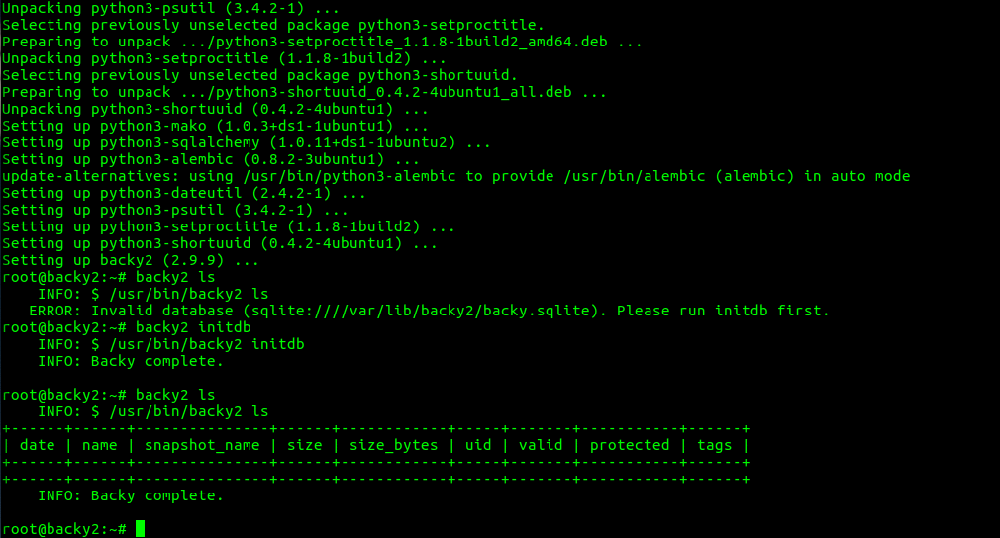

.. backy2 documentation master file, created by
   sphinx-quickstart on Thu Apr 13 12:57:59 2017.
   You can adapt this file completely to your liking, but it should at least
   contain the root `toctree` directive.

.. include:: global.rst.inc

backy2 documentation
====================

.. include:: ../../README.rst

.. toctree::
   :maxdepth: 2

   quickstart
   configuration
   backup
   scrub
   restore
   cleanup
   administration
   datalayout
   support
   license
