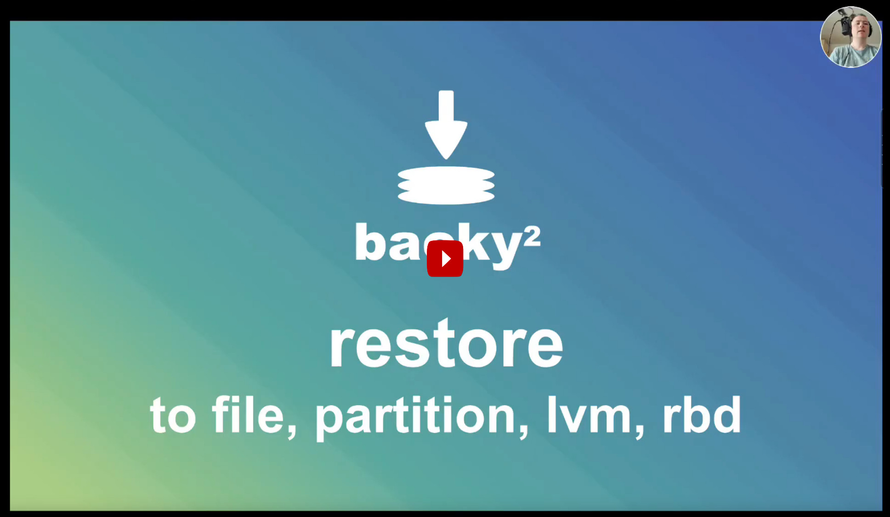

.. include:: global.rst.inc

.. _restore:

Restore
=======

.. command-output:: backy2 restore --help

Overview
--------

There are two possible restore options:

Full restore
------------

A full restore happens either into a file (i.e. an image file), to a device (e.g.
/dev/hda) or to a ceph/rbd-volume.

The target is specified by the URI schema. Examples::

    $ backy2 restore <version_uid> file:///var/lib/vms/myvm.img
    $ backy2 restore -f <version_uid> file:///dev/hdm
    $ backy2 restore <version_uid> rbd://pool/myvm_restore

If the target already exists as

- it is a device file
- the rbd volume exists
- the image file exists

you need to ``--force`` the restore. Without ``--force`` backy2 will break with
an error and give you a hint::

    backy2 restore 90fbbeb6-1fbe-11e7-9f25-a44e314f9270 file://tmp/T
        INFO: $ /home/dk/develop/backy2/env/bin/backy2 restore 90fbbeb6-1fbe-11e7-9f25-a44e314f9270 file://tmp/T
       ERROR: Target already exists: file://tmp/T
    Error opening restore target. You must force the restore.

.. NOTE:: When restoring to a ceph/rbd volume, backy2 will create this rbd
    volume for you if it does not exist.

If the restore-target is full of 0x00 bytes, you can use the ``-s`` or ``--sparse``
option for faster restores. With ``-s`` backy2 will not write (i.e. skip) empty
blocks or blocks that contain only 0x00 bytes.

Usually you can use ``-s`` if your restore target is

- a new/non-existing ceph/rbd volume
- a new/non-existing image file (backy2 will then create a sparse file)

.. CAUTION:: If you use ``-s`` on existing images, devices or files, restore-blocks which
    do not exist or contain only 0x00 bytes will not be written, so whatever
    random data was in there before the restore will remain.

Live-mount with FUSE
--------------------

FUSE is a filesystem in userspace. ``backy2`` can create a mountpoint for its
backups. Example::

    $ backy2 fuse /mnt

All existing backups are then available in /mnt::

   $ tree /mnt
   mnt
   ├── by_name
   │   └── sometest1
   │       ├── 0c44841a-8d47-11ea-8b2d-3dc6919c2aca -> ../../by_version_uid/0c44841a-8d47-11ea-8b2d-3dc6919c2aca
   │       ├── 60ae794e-8d46-11ea-8b2d-3dc6919c2aca -> ../../by_version_uid/60ae794e-8d46-11ea-8b2d-3dc6919c2aca
   │       └── 9d8cfe80-8d46-11ea-8b2d-3dc6919c2aca -> ../../by_version_uid/9d8cfe80-8d46-11ea-8b2d-3dc6919c2aca
   └── by_version_uid
       ├── 0c44841a-8d47-11ea-8b2d-3dc6919c2aca
       │   ├── data
       │   ├── expire
       │   ├── name
       │   ├── snapshot_name
       │   ├── tags
       │   └── valid
       ├── 60ae794e-8d46-11ea-8b2d-3dc6919c2aca
       │   ├── data
       │   ├── expire
       │   ├── name
       │   ├── snapshot_name
       │   ├── tags
       │   └── valid
       └── 9d8cfe80-8d46-11ea-8b2d-3dc6919c2aca
           ├── data
           ├── expire
           ├── name
           ├── snapshot_name
           ├── tags
           └── valid

   $ ls -l /mnt/by_version_uid/0c44841a-8d47-11ea-8b2d-3dc6919c2aca/data
   -rw------- 1 root root 293529518 Mai  3 14:04 /mnt/by_version_uid/0c44841a-8d47-11ea-8b2d-3dc6919c2aca/data

Here's what the directories/files contain:

**by_name**: Unique names for the backups
**by_name/<name>**: Symlinks to the version directories
**by_version_uid**: All existing version_uids. The direcories' date is the version's date
**by_version_uid/<uid>/data**: The binary data
**by_version_uid/<uid>/expire**: The expiration date (example: 2020-04-20T01:02:03)
**by_version_uid/<uid>/name**: The backup's name
**by_version_uid/<uid>/snapshot_name**: The snapshot name
**by_version_uid/<uid>/tags**: Comma separated list of given tags for the version
**by_version_uid/<uid>/valid**: Only exists (and contains 'valid') when the version is valid
**by_version_uid/<uid>/invalid**: Only exists (and contains 'invalid') when the version is invalid
**by_version_uid/<uid>/protected**: Only exists (and contains 'protected') when the version is protected

If the data contains partitions, you may make them accessible by creating a loop device and
then ``partprobe``'ing the partitions::

   # losetup /dev/loop100 /mnt/by_version_uid/0c44841a-8d47-11ea-8b2d-3dc6919c2aca/data
   # partprobe /dev/loop100
   # mount /dev/loop100p1 /mnt2

.. NOTE::
   All data files are made writeable by backy2. Writes will be buffered
   into a temporary file (the file will be created in the configured ``cachedir``
   in ``backy2.cfg``). Please make sure the file has enough place to grow
   for your changes.
   No writes will ever change the version. Writes only exist while ``backy2 fuse``
   is running.

If the data contains a filesystem, you may directly mount it::

   # mount /mnt/by_version_uid/0c44841a-8d47-11ea-8b2d-3dc6919c2aca/data /mnt2

To finish the fuse mount, press ``ctrl+c`` on the ``backy2 fuse`` command.
backy2 will then cleanup the temporary file and the mountpoint will be
removed.

.. TIP::
   If you want to fusemount as user, you must enable ``user_allow_other`` in
   /etc/fuse.conf.

Restore continuation
--------------------

If your backup target (=restore source) or your restore target are unstable,
it can happen that you're unable to restore a full backup due to service
interruptions on these storages.

In that case you can resume a stopped restore process, even if backy2 stops
working in strange ways (actually you may also just kill the backy2 process by
pressing ctrl+c or killing the process).

For hinting from where to start writing to the restore-target again, backy2
outputs ``Last ID`` as the hint which was the last block until which **all**
blocks have been written successfully to the restore-target.

.. NOTE:: This especially works even with asynchronuous writes as we have
   them when using the simultanuous_writes config variable.

You can then pass the last block-ID that you have seen during the restore
process to ``backy2 restore``. It's important however that you use the exactly
same parameters as before when restoring::

   $ backy2 restore 30d53cea-7ff8-11ea-9466-8931a4889813 file://test.img
       INFO: $ backy2 restore 30d53cea-7ff8-11ea-9466-8931a4889813 file://test.img
       INFO: Restore phase 1/2 (sparse) to null:// Read Queue [          ] Write Queue [          ] (0.4% 0.0MB/sØ ETA 1s) 
       INFO: Restore phase 2/2 (data) to null:// Read Queue [=         ] Write Queue [          ] (0.4% 0.0MB/sØ ETA 13s) Last ID: None
       INFO: Restore phase 2/2 (data) to null:// Read Queue [==========] Write Queue [          ] (20.7% 197.3MB/sØ ETA 4s) Last ID: 42
   ^CTraceback (most recent call last):
     File "/home/dk/develop/backy2/env/bin/backy2", line 11, in <module>
       load_entry_point('backy2', 'console_scripts', 'backy2')()
     File "/home/dk/develop/backy2/src/backy2/scripts/backy.py", line 749, in main
       func(**func_args)
     File "/home/dk/develop/backy2/src/backy2/scripts/backy.py", line 103, in restore
       backy.restore(version_uid, target, sparse, force, int(continue_from))
     File "/home/dk/develop/backy2/src/backy2/backy.py", line 380, in restore
       data_checksum = self.hash_function(data).hexdigest()
   KeyboardInterrupt

   $ backy2 restore 30d53cea-7ff8-11ea-9466-8931a4889813 file://test.img -c 42
       INFO: $ backy2 restore 30d53cea-7ff8-11ea-9466-8931a4889813 file://test.img -c 42
       INFO: Restore phase 1/2 (sparse) to null:// Read Queue [          ] Write Queue [          ] (16.8% 0.0MB/sØ ETA 0s) 
       INFO: Restore phase 2/2 (data) to null:// Read Queue [====      ] Write Queue [          ] (0.5% 0.0MB/sØ ETA 23s) Last ID: None
       INFO: Restore phase 2/2 (data) to null:// Read Queue [==========] Write Queue [          ] (38.3% 292.1MB/sØ ETA 2s) Last ID: 122
       INFO: Backy complete.

.. HINT:: If you don't see why ``-c 42`` has been used in the above command,
   you will need to scroll to the right as output is cut in this documentation.
   Then you'll see ``Last ID: 42``.

Edge-Cases
----------

Invalid blocks / versions
~~~~~~~~~~~~~~~~~~~~~~~~~

During full restore, backy2 will compare each restored block's checksum to the
stored checksum from the metadata store **no matter if the block has been
marked invalid previously**. If it encounters a difference, the block
and all versions containing this block will be marked *invalid* and a warning
will be given::

   ERROR: Checksum mismatch during restore for block 2558 (is: a134381a9760b5569cdaa2b1496483a5cef0428b2de351593599aaac4a5525e8dc97610a3cf515bce685d1e2a1e76c054c3438382588669a909e2073dac1a25c should-be: asd, block-valid: 0). Block restored is invalid. Continuing.
    INFO: Marked block invalid (UID 73923236eb5ttp7DJ6BdynMfwMnZamTF, Checksum asd. Affected versions: 90fbbeb6-1fbe-11e7-9f25-a44e314f9270, bc1af5e0-2f1c-11e7-b961-a44e314f9270, 0ffaf1ba-2f1d-11e7-b961-a44e314f9270, 2563c0a4-2f1d-11e7-b961-a44e314f9270, 430d4f4e-2f1d-11e7-b961-a44e314f9270

Even when encountering such an error, backy2 will continue to restore.

.. NOTE:: The philosophy behind this is that restores must allways succeed, even if there
    are errors in the data. Most times invalid data is on irrelevant places or can
    be fixed later. It's always worse to crash/break the restore process when an
    error occurs.

The ``null://`` target
----------------------

As there's the null://<size> source, there's also a null:// target. You may use
this for performance-testing or bottleneck-tests, but of course all "written"
data will just be lost.
Example::

    $ backy2 restore 30d53cea-7ff8-11ea-9466-8931a4889813 null://

